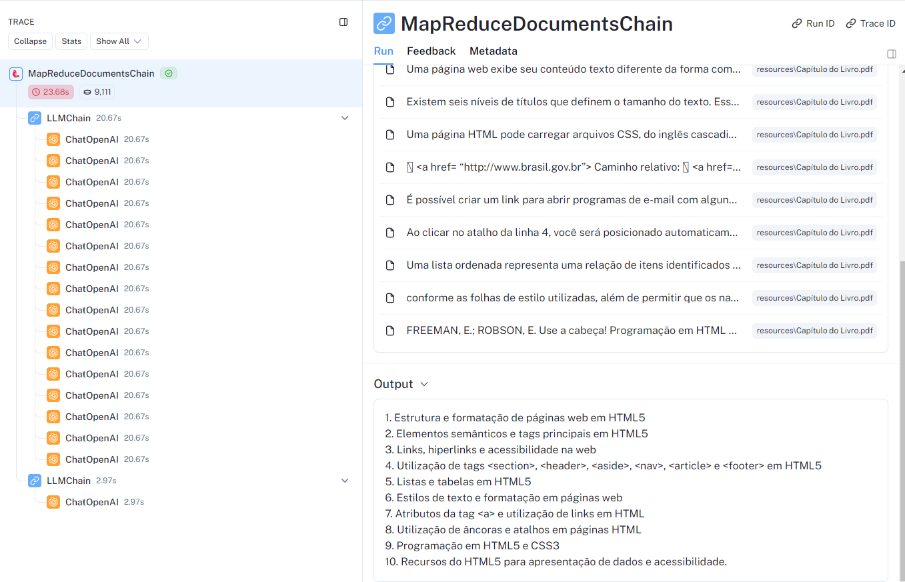
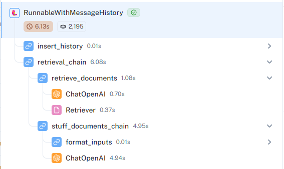
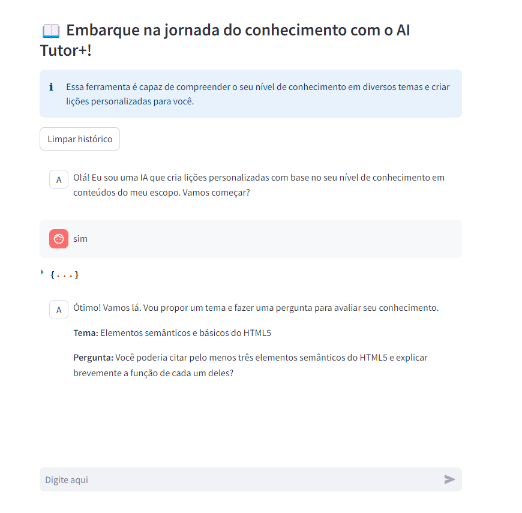

# Introdução

Esse repositório contém a implementação de um chatbot para geração de 
conteúdos com base no nível de conhecimento do usuário. O escopo dos conteúdos 
é definido por meio de um conjunto de arquivos acessíveis ao chatbot.

A solução foi construída com os módulos Langchain e Streamlit.

# Arquitetura da solução

A implementação é composta por dois módulos principais: 

- Sumarização
- Chat Conversacional

O módulo de sumarização é responsável por percorrer os documentos de escopo 
fornecidos e gerar uma lista de tópicos sobre os conteúdo que eles 
abrangem.

O módulo Chat Conversacional, por sua vez, interage com o usuário para 
identificar tópicos que precisam ser ensinados e apresentar as lições. O 
tópico atual da conversa é embasado através de documentos específicos 
relacionados a ele.

O esquemático a seguir mostra o detalhamento dos processos executados em 
cada módulo. Toda a implementação foi realizada no script *app.py*.

### Sumarização

No módulo de sumarização, a pasta *resources* é acessada usando o
*DirectoryLoader*, que extrai informações textuais de arquivos de diversos 
formatos, como textos, imagens e vídeos. As informações resultantes são 
chamadas de *Documentos*. Em seguida, a classe *CharacterTextSplitter* divide 
os documentos em lotes de tamanho personalizado para facilitação do uso com 
LLMs. Os documentos divididos são, então, armazenados na memória, em um 
banco de dados vetorizado, para posterior recuperação (retrieval) de 
informações. 

O fluxo do módulo Sumarização continua com um processo recursivo onde diversas 
LLMs recebem prompts contendo os textos de um conjunto de documentos e 
instruções para resumir o conteúdo em tópicos. Por fim, outra LLM recebe um 
prompt contendo um conjunto de sumários e instruções para agrupá-los e 
constituir um sumário final, contendo a lista de tópicos dos conteúdos 
dos documentos. Vale notar que a implementação da sumarização de forma 
recursiva permite que um grande número de documentos seja sumarizado sem 
que o limite da janela de contexto da LLM seja extrapolado.

A execução do módulo de Sumarização pode levar um tempo considerável caso o 
número de arquivos seja muito grande. Por isso, a execução é feita somente 
na inicialização do chat e tanto o sumário final quanto o banco de dados 
vetorizados são armazenados na memória. Uma alternativa é fazer esse 
processo de forma offline e só repeti-lo quando houver mudanças na base de 
dados.

A Figura a seguir mostra a cadeia *MapReduceDocuments* do módulo de 
Sumarização. Perceba que cada LLM da primeira cadeia *LLMChain* sumariza um 
documento e a segunda *LLMChain* resume todos os sumários obtidos.

### Chat Conversacional

No módulo Chat Conversacional a cadeia é iniciada com uma LLM com 
instruções para resumir o tópico mais recente da discussão, contida na 
memória do chat. Com essa informação, uma busca por similaridade é 
realizada no banco de dados vetorizado, obtendo os trechos mais relevantes 
dos arquivos para servirem de contexto. Por fim, o prompt da LLM 
conversacional é alimentado com a entrada atual do usuário, os documentos 
relevantes, a lista de todos os tópicos e as seguintes instruções, 
resumidamente:

> Você é uma IA conversacional especializada em educação, cujo objetivo é 
> interagir com o usuário sobre os temas do seu conhecimento. Você propõe um 
> tema, avalia o conhecimento do usuário com uma pergunta e, com base nesse 
> nível de conhecimento, cria uma lição personalizada.

Uma forma de simplificar esse processo é eliminar uma parte do módulo 
Sumarização e colocar todos os documentos na janela de contexto da LLM 
conversacional. Entretanto, essa abordagem não é escalável para grandes 
quantidades de arquivos e por isso não foi escolhida.

A Figura a seguir mostra a cadeia *RunnableWithMessageHistory* do módulo de 
Chat Conversacional. Observe que a cadeia *insert_history* lida 
com a atualização do histórico da conversa, a cadeia cada 
*retrieval_documents* obtém o conteúdo dos documentos mais relevantes do 
momento e *stuff_documents_chain* compila todo o contexto para que a LLM do 
chat formule a resposta para o usuário.

### Scripts auxiliares

O repositório conta também com os scripts *rag_test.py* e *chat_test.py*. 
Apesar de não serem necessários para a aplicação, eles foram mantidos pois 
foram utilizados durante a implementação para aprendizado, testes e como 
provas de conceitos (POCs).

*rag_test.py* contém os processos de carregamento, divisão, 
codificação e indexação de documentos. Ele pode ser executado normalmente 
com *python rag_test.py*. Já o *chat_test.py* contém um chabot simples
com instruções para identificar o nível de inglês do usuário e fornecer 
lições personalizadas para o aprendizado da lingua. Ele é executado com o 
comando *streamlit run chat_test.py*.

# Setup

A implementação desse repositório foi realizada em Windows, mas pode ser 
adaptada para execução em Linux. Considerando a execução em Windows, 
realize os seguintes passos para preparação do repositório:

1. Certifique-se de utilizar o Python 3.10;
2. Faça a clonagem do repositório no diretório de interesse;
3. Crie um ambiente virtual para instalação das dependências: *python -m 
   venv {nome_do_ambiente}*
4. Ative o ambiente virtual: *{nome_do_ambiente}\Scripts\activate.bat*
5. Instale as dependências dos projeto com *pip install -r requirements.txt*
6. Siga as instruções 
   [aqui](https://pdf2image.readthedocs.io/en/latest/installation.html) para 
   instalar 
   o módulo pdf2image e adicionar ao PATH;
7. Instale o módulo Tesseract através do executável 
   [aqui](https://github.com/UB-Mannheim/tesseract/wiki). Adicione o 
   diretório de instalação ao PATH. 
   [Referência](https://stackoverflow.com/questions/50951955/pytesseract-tesseractnotfound-error-tesseract-is-not-installed-or-its-not-i)  

Antes de rodar a aplicação, é necessário configurar o arquivo .env. Para 
isso, crie um arquivo com o nome .env com o mesmo conteúdo de .env.example, 
preenchendo com suas chaves de API *OPENAI_API_KEY* e *LANGCHAIN_API_KEY*.

A chave da OpenAI é necessária para rodar a aplicação. Já a chave do 
LangChain é opcional, mas recomendada, para a visualização detalhada do 
fluxo de informações das cadeias na plataforma do 
[LangSmith](https://smith.langchain.com/). Crie uma gratuitamente seguindo 
esses [passos](https://medium.com/@lei.shang/getting-started-with-langsmith-a-step-by-step-walkthrough-a5ca09adca43).
Se desejar não utilizar o LangSmith, comente ou apague as variáveis 
*LANGCHAIN_TRACING_V2*, *LANGCHAIN_ENDPOINT* e *LANGCHAIN_API_KEY*.

### Execução

A aplicação deve ser executada com o comando *streamlit run app.py --server.
port 8051*. Caso o 
navegador não abra automaticamente com a aplicação, acesse:
http://localhost:8501/

IMPORTANTE: Para execuções posteriores utilize outras portas no comando de 
execução. Caso tente novamente com a mesma porta, o erro *ValueError: Could 
not connect to tenant default_tenant. Are you sure it exists?* ocorrerá. Nesse 
caso, atualize a página e aguarde que a aplicação irá funcionar. Esse é um bug 
cuja solução não foi encontrada em tempo. Ele está provavelmente associado à 
execuções subsequentes da aplicação Streamlit em uma mesma porta. 

# Interface

A Figura abaixo mostra a interface intuitiva do Chat, onde o usuário pode 
interagir com a IA para receber lições sobre temas dos arquivos fornecidos.

O botão "Limpar histórico" apaga o histórico e reinicia a conversa. Já o 
dicionário com os três pontos em laranja (nesse caso, ocultado clicando na 
seta) serve apenas para fins expositivos e debug, explicitando as 
variáveis da cadeia 
(*input*, *history*, *context* e *answer*).

De forma evitar janelas de contexto muito grandes, optou-se por limitar o 
histórico da cadeia em 16 mensagens. Assim, caso esse limite seja alcançado,
as mensagens mais antigas vão sendo apagadas da memória da cadeia. A 
memória dinâmica da cadeia pode ser visualizada no dicionário de debug.

# Dificuldades de implementação e próximos passos

### Banco de dados vetorizado persistente

Criar formas de manter o banco de dados vetorizados persistente, de forma 
eficiente. Assim, ele não precisa ser criado toda vez que o chat é 
inicializado, a menos que os arquivos mudem.

### Indexação de arquivos .mp4 e .json

A classe *DirectoryLoader* deveria suportar o carregamento de múltiplos 
tipos de arquivo. Porém, na tentativa de carregar arquivos JSON o erro 
*ValueError: Json schema does not match the Unstructured schema* acontece. 
Além disso, o módulo não é compatível com arquivos .mp4. Por falta de tempo, 
optou-se por ignorar o carregamento desses dois arquivos.

Como próximos passos, recomenda-se explorar novas bibliotecas para carregar 
os formatos de arquivo não compatíveis com *DirectoryLoader* e anexar à 
solução.

### Geração de conteúdos dinâmicos

Os conteúdos gerados pela LLM se limitaram a conteúdos textuais. Não foi 
possível abordar em tempo a geração de conteúdos em áudio e vídeo.

O próximo passo é explorar outras LLMs generativas para geração de vídeos e 
estudar formas de incluí-las na implementação de cadeias do Langchain. A 
geração de conteúdos com áudio pode ser realizada com alguma ferramenta que 
faça a leitura do texto, sem necessidade de modelos de IA.