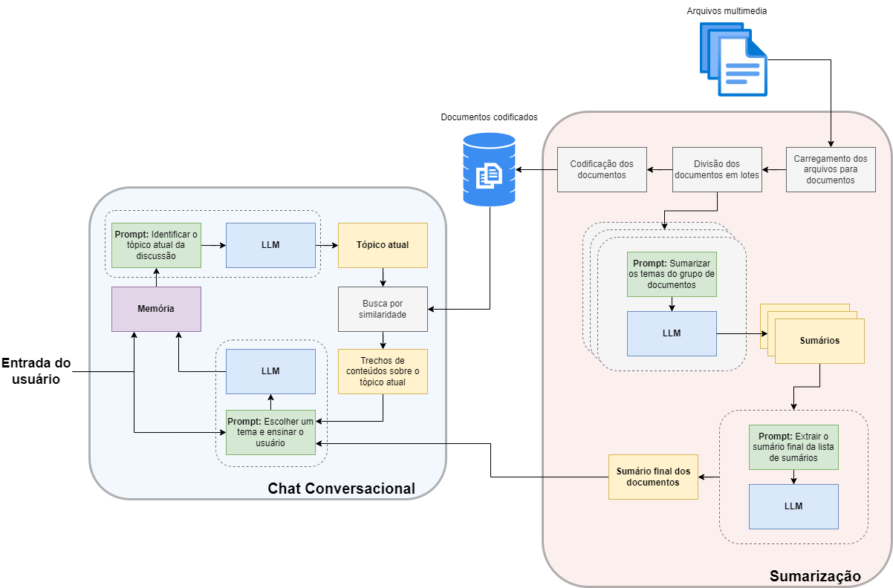

# Introdução

Esse repositório contém a implementação de um chatbot para geração de 
conteúdos com base no nível de conhecimento do usuário. O escopo dos 
conteúdos é limitado por um conjunto de arquivos, o qual o chat possui 
acesso.

A solução foi construída com os módulos Langchain e Streamlit.

# Arquitetura da solução

A solução é composta por dois módulos principais: 

- Sumarização
- Chat Conversacional

O módulo de sumarização é responsável por percorrer os documentos de escopo 
fornecidos e gerar uma lista de tópicos sobre os conteúdo que eles 
abrangem.

O módulo Chat Conversacional, por sua vez, interage com o usuário para 
identificar tópicos que precisam ser ensinados e apresentar as lições. O 
tópico atual da conversa é embasado através de documentos específicos 
relacionados a ele.

O esquemático a seguir mostra o detalhamento dos processos executados em 
cada módulo:

Toda a implementação foi realizada no script *app.py*.

### Sumarização

No módulo de sumarização, a pasta *resources* é acessada através do 
*DirectoryLoader*, o qual extrai informações textuais de arquivos de diversos 
formatos, como textos, imagens e vídeos. As informações resultantes são 
chamadas de *Documentos*. Em seguida, a classe *CharacterTextSplitter* divide 
os documentos em lotes de tamanho personalizado para facilitação do uso com 
LLMs. Os documentos divididos são então salvos em um banco de dados 
vetorizado (pasta db_docs) para posteriormente serem utilizados para 
recuperação (retrieval) de informações. 

O fluxo do módulo Sumarização continua com um processo recursivo onde uma 
LLM recebe prompts contendo os textos de um conjunto de documentos e 
instruções para resumir o conteúdo em tópicos. Por fim, outra LLM recebe um 
prompt contendo um conjunto de sumários e instruções para agrupá-los e 
constituir um sumário final, contendo a lista de tópicos dos conteúdos 
dos documentos. Vale notar que a implementação da sumarização de forma 
recursiva permite que um grande número de documentos seja sumarizado sem 
que o limite da janela de contexto da LLM seja extrapolado.

A execução do módulo de Sumarização pode levar um tempo considerável caso o 
número de arquivos seja muito grande. Por isso, a execução é feita somente 
na inicialização do chat e tanto o sumário final quanto o banco de dados 
vetorizados são armazenados. Uma alternativa é fazer esse processo de forma 
offline e só repeti-lo quando houver mudanças na base de dados.

### Chat Conversacional

No módulo Chat Conversacional a cadeia é iniciada com uma LLM com 
instruções para resumir o tópico mais recente da discussão, contida na 
memória do chat. Com essa informação, uma busca por similaridade é 
realizada no banco de dados vetorizado, obtendo os trechos mais relevantes 
dos documentos para servirem de contexto. Por fim, o prompt da LLM 
conversacional é alimentado com a entrada atual do usuário, os trechos 
relevantes dos documentos, a lista de todos os tópicos e as seguintes 
instruções, resumidamente:

> Interaja com o usuário para identificar conteúdos que ele mais precisa 
> aprender, com base no escopo fornecido a você. Em seguida, crie lições 
> personalizadas para cada tópico com base no nível de conhecimento do usuário.

Uma forma de simplificar esse processo é eliminar o módulo Sumarização e 
colocar todos os documentos na janela de contexto da LLM conversacional. 
Entretanto, essa abordagem não é escalável para grandes quantidades de 
arquivos e por isso não foi escolhida.

### Scripts auxiliares

O repositório conta também com os scripts *rag_test.py* e *chat_test.py*. 
Apesar de não serem necessários para a aplicação, eles foram mantidos pois 
foram utilizados durante a implementação para aprendizado, testes e como 
provas de conceitos (POCs).

*rag_test.py* contém os processos de carregamento, divisão, 
codificação e indexação de documentos. Ele pode ser executado normalmente 
com *python rag_test.py*. Já o *chat_test.py* contém um chabot simples
com instruções para identificar o nível de inglês do usuário e fornecer 
lições personalizadas para o aprendizado da lingua. Ele é executado com o 
comando *streamlit run chat_test.py*.

# Setup

A implementação desse repositório foi realizada em Windows, mas pode ser 
adaptada para execução em Linux. Considerando a execução em Windows, 
realize os seguintes passos para preparação do repositório:

1. Certifique-se de utilizar o Python 3.10;
2. Faça a clonagem do repositório no diretório de interesse;
3. Crie um ambiente virtual para instalação das dependências: *python -m 
   venv {nome_do_ambiente}*
4. Ative o ambiente virtual: *{nome_do_ambiente}\Scripts\activate.bat*
5. Instale as dependências dos projeto com *pip install -r requirements.txt*
6. Siga as instruções em 
   https://pdf2image.readthedocs.io/en/latest/installation.html para instalar 
   o módulo pdf2image e adicionar ao PATH;
7. Instale o módulo Tesseract através do executável em
   https://github.com/UB-Mannheim/tesseract/wiki. Adicione o diretório de 
   instalação ao PATH. Referência: 
   https://stackoverflow.com/questions/50951955/pytesseract-tesseractnotfound-error-tesseract-is-not-installed-or-its-not-i  

A aplicação deve ser executada com o comando *streamlit run app.py*

# Dificuldades de implementação

### Indexação de arquivos .mp4 e .json

A classe *DirectoryLoader* deveria suportar o carregamento de múltiplos 
tipos de arquivo. Porém, na tentativa de carregar arquivos JSON o erro 
*ValueError: Json schema does not match the Unstructured schema* acontece. 
Além disso, o módulo não é compatível com arquivos .mp4.

Por falta de tempo, optou-se por ignorar o carregamento desses dois arquivos.

### Geração de conteúdos dinâmicos

Os conteúdos gerados pela LLM se limitaram a conteúdos textuais. Não foi 
possível abordar em tempo a geração de conteúdos em áudio e vídeo.
